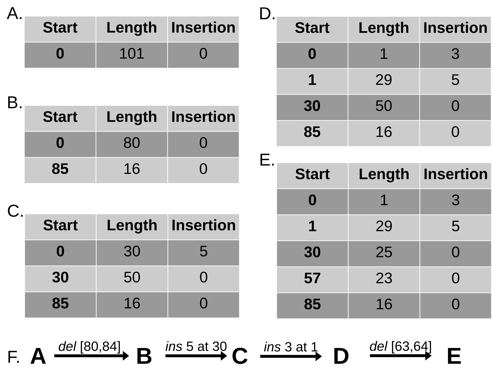
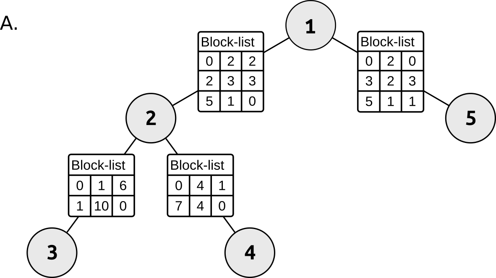

# Simulating Biological Sequence Evolution

### Elya Wygoda
#### Prof. Tal Pupko's lab

--- 

## The Challenge of Evolutionary Simulation

- Biological sequences (DNA, RNA, proteins) evolve through discrete events
- Events occur with different rates and probabilities
- Naive insertion and deletion (indel) simulation approaches are computationally inefficient
- Need: A fast and accurate method that simulates indels

---

  
---

## The Gillespie Algorithm: Core Concept

- Developed by Daniel Gillespie (1976) for chemical reaction systems
- Perfect for simulating evolutionary events (mutations, selection, etc.)
- **Key insight**: Jump directly from one event to the next
- Skips "empty" time intervals where nothing happens

---

## How It Works: Two Key Steps

1. **Time Step Determination**:
   - Sample waiting time until next event from exponential distribution
   - Total event rate determines the parameter
  
2   . **Event Selection**:
   - Choose which event occurs proportional to its rate
   - Higher rate events are more likely to be selected

---

<iframe src="gillespie-simulation.html" width="100%" height="100%" ></iframe>

<!-- Note: For this to work, you'll need to export the HTML animation to a file named gillespie-  animation.html 
     in the same directory as your presentation. If using a different presentation platform, 
     you can include screenshots of key steps instead. -->

---

## Advantages for indel simulation

- Only simulates actual events, not empty time steps

## Problems with this approach

- Each indel event requires copying the previous sequence, and applying the event.

---

# Solution: Indel bookkeeping

- A data strucutre that logs the envets efficiently.
- No need to perform the event directly on the sequence.
- Major time and space savings.

---

---

---

# Key Takeaways

- You don't even need a root sequence to simulate indels!
- A block based bookkeeping approach makes indel simulation extremely fast.

---

# Thank You
### Questions?

